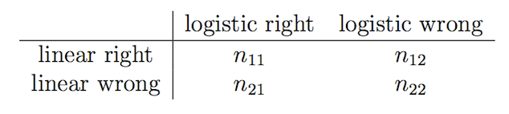

```{r setup, include=FALSE}
knitr::opts_chunk$set(echo = TRUE)
```

1. Suppose we collect data for a group of students in a statistics class with variables $X_1 =$ hours studied, $X_2 =$ undergrad GPA, and $Y =$ receive an A. We fit a logistic regression and produce estimated coefficient, $\hat{\beta}_0 = -5$, $\hat{\beta}_1 = 0.075$, $\hat{\beta}_2 = 1.1$.  

    (a) Estimate the probability that a student who studies for 40 hours and has an undergrad GPA of 3.5 gets an A in the class.
    
        We define the multiple linear model as $$ log(\frac{p(X)}{1 - P(X)}) = {\beta}_0 + {\beta}_1 * X_1 + {\beta}_2 * X_2$$
        
        Then we can plug in these estimate values, we can get $log(\frac{p(X)}{1 - P(X)}) = -5 + 0.075 * 40 + 1.1 * 3.5 = 1.85$ and we take the logarithm on both side we get $\frac{p(X)}{1 - p(X)}$ = 6.35982, so $P(X) = 0.864$

    (b) How many hours would the student in part (a) need to study to have a 50% chance of getting an A in the class?  
    
        $0.5 = \frac{e^{-5 + 0.075 * X_1 + 1.1 * X_2}}{1 + e^{-5 + 0.075 * X_1 + 1.1 * X_2}}$, 
        
        so $e^{-5 + 0.075 * X_1 + 1.1 * X_2} = 1, -5 + 0.075 * X_1 + 1.1 * X_2 = 0, X_2 = 3.5$ we can get $X_1 = 15.3$

2. Suppose we estimate the regression coefficients in a linear regression model by minimizing
\[ \sum_{i=1}^n \left( y_i - \beta_0 - \sum_{j=1}^p \beta_j x_{ij} \right)^2 \quad \text{subject to}\quad \sum_{j=1}^p |\beta_j| \leq s \]
for a particular value of $s$. For parts (a) through (e), indicate which of i. through v. is correct. Justify your answer.  

    (a) As we increase $s$ from 0, the training RSS will:  
        
        Streadily decrease. As we loosen the restriction on the coefficients, the model will fit the the training set more and more which will decrease the RSS.  
    
    (b) Repeat (a) for test RSS.  
        
        Decrease initially, and then eventually start increaseing in a U shape. First the RSS will decrease because as the model becomes more flexible and it will hit a minimal point, then the RSS will increase because model tends to overfit the training set and variance start to play an important part of the total error.

    (c) Repeat (a) for variance.  
    
        Steadily increase. According to the bias-variance trade off, A more flexible model will have a higher variance. When we increase $s$ from 0, the flexiblity is increasing, thus the variance is increasing.
        
    (d) Repeat (a) for (squared) bias.  
    
        Steadily decrease. According to the bias-variance trade off, A more flexible model will have a lower bias. When we increase $s$ from 0, the model is becoming more flexible, thus the bias is decreasing.
        
    (e) Repeat (a) for the irreducible error.  
    
        Remain constant. No matter how perfect our estimation is, there is still some error in it and cannot be reduced by model.

3. Suppose that we use some statistical learning method to make a prediction for the response $Y$ for a particular value of the predictor $X = x$. Carefully describe how we might estimate a confidence interval for (a) our prediction of $Y$ at $x$ and (b) the $E(Y |X = x)$.  

    (a) we can use the bootstrap. We repeatly sample observations from the original data set and each time we can compute the estimate value $\hat{\alpha}^{*B}$. After multiple times, we can get the mean of response and standard deviation. Based on these two parameters we can compute the confidence interval.
    
    (b) We random pick observations from the original data set to do the bootstrap and record the response and that specific value of predictor. After repeatint this process multiple times, we can compute the $E(Y |X = x)$ based on the records.

4. Logistic regression can give poor results when the two classes can be perfectly separated by a linear decision boundary. Consider just a logistic regression with a single predictor, $X$, so that our model is
\[ p(X) = \frac{e^{\beta_0 + \beta_1 X}}{1 + e^{\beta_0 + \beta_1 X}} \]  
Remember that the estimates $\hat{\beta}_0$ and $\hat{\beta}_1$ maximize the likelihood function
\[ L(\beta_0, \beta_1) = \prod_{i: y_i = 1} p(x_i) \prod_{i': y_{i'} = 0} (1 - p(x_{i'})) \]
for the observed data $\{(x_i, y_i)\}_{i=1}^n$.  

    (a) Show that the likelihood function $L(\beta_0, \beta_1)$ is always strictly less than 1.  
    
        Since $p(x_i)$ denotes the probability of the response of the $i^{th}$ observation and can be calcuted through $p(X) = \frac{e^{\beta_0 + \beta_1 X}}{1 + e^{\beta_0 + \beta_1 X}}$, no matter what value we give to $X$, it can only be between 0 and 1. The likelihood function is the product of two cumulative product, and each value is between 0 and 1, so the final result will always in range of 0 and 1.
        
    (b) Suppose that all of the $x_i$ corresponding to $y_i = 0$ are negative, and all of the other $x_i$ are positive. In that case, show that we can get $L(\beta_0, \beta_1)$ arbitrarily close to 1. That is, show that for any value $a < 1$, no matter how close to 1, you can always find values $\beta_0$ and $\beta_1$ for which $L(\beta_0, \beta_1) > a$.  
    Explain why this means that $\hat{\beta}_0$ and $\hat{\beta}_1$ are undefined.  
    
        As we know from the question, $P(Y = 0 |X < 0) = 1, P(Y = 1 |X > 0) = 1$. Ideally based on these equations the likelihood function should equal to 1. However according to Question (a), we know the likelihood function is always strictly less than 1, so we cannot get the best estimates for $\hat{\beta}_0$ and $\hat{\beta}_1$ which has the largest likelihood value. Because there are always better estimates for $\hat{\beta}_0$ and $\hat{\beta}_1$ to make the likelihood function apporoach to 1 but never reach 1.

    (c) Show that $\hat{\beta}_0$ and $\hat{\beta}_1$ are similarly undefined if there is *any* value $c$ for which every $x_i$ corresponding to $y_i = 0$ is less than $c$ and every other $x_i$ is larger than $c$. In fact, the same is true for multivariate logistic regression. Whenever there is a linear decision boundary that perfectly separates the two classes, the maximum likelihood logistic regression coefficients are undefined (but you don't have to prove this last fact).  
    
        We can denote the probability as $P(Y = 0 |X < c) = 1, P(Y = 1 |X > c) = 1$. No matter what value $c$ has, it's still the same concept as Question (b), we can't get the best estimates for $\hat{\beta}_0$ and $\hat{\beta}_1$ which has the largest likelihood value because the likelihood function is always apporoaching to 1 but never reach 1.
        
    (d) Come up with your own data set of the form in (c) and fit a logistic regression to it in R. Plot your data, as well as the logistic regression fit $\hat{p}(x)$.  
    You will probably get warning messages that the fit didnot converge, and that you have numerically 0 or 1 fitted probabilities. The first message usually signals that you have fit a logistic regression to perfectly separable classes.
```{r}
# predictor
pred = runif(100, 0, 1)

# response
res = rep(0, 100)
res[pred > 0.5] = 1

plot(res ~ pred, col = "blue")
fit <- glm(res ~ pred, family = binomial)
summary(fit)
```

        

5. This question should be answered using the `Weekly` dataset, which is part of the `ISLR` package. This data is similar in nature to the `SMarket` data used in section 4.6 of our textbook, except that it contains 1,089 weekly returns for 21 years, from the beginning of 1990 to the end of 2010.  

    (a) Use the full dataset to perform a logistic regression with `Direction` as the `response` and the five lag variables plus `Volume` as predictors. Call your model `glm.fit`. Use the summary function to print the results. Do any of the predictors appear to be statistically significant? If so, which ones?  
    
```{r}
require(ISLR)
attach(Weekly)
glm.fit <- glm(Direction ~ Lag1 + Lag2 + Lag3 + Lag4 + Lag5 + Volume, data = Weekly, family = binomial)
summary(glm.fit)
```   
  $Log2$ has the relatively smallest p-value and is more statistically significant than other variables.    
        
    
  (b) Use the following code to produce the confusion matrix for this problem.  
    
    ```R
    glm.probs = predict(glm.fit, type = "response")
    glm.pred = rep("Down", length(glm.probs))
    glm.pred[glm.probs > 0.5] = "Up"
    table(glm.pred, Weekly$Direction)
    ```
    Explain what the confusion matrix is telling you about the types of mistakes made by logistic regression.
    
```{r}
glm.probs = predict(glm.fit, type = "response")
glm.pred = rep("Down", length(glm.probs))
glm.pred[glm.probs > 0.5] = "Up"
table(glm.pred, Weekly$Direction)
mean(glm.pred == Weekly$Direction)
```
  This matrix tell us the misclassification rate on the training data. The diagonal/anti-diagonal of the matrix is showing how many correct/wrong predictions we make on the training data.


  (c) Now fit the logistic regression model using a training data period from 1990 to 2008, with `Lag1`, `Lag2`, and `Lag3` as the only predictors. Compute the confusion matrix and the overall fraction of correct predictions for the held out data (that is, the data from 2009 and 2010).
```{r}
traingSet = subset(Weekly, Year %in% 1990: 2008)
testSet = subset(Weekly, Year %in% 2009: 2010)
# fit the logitics model
glm.fit <- glm(Direction ~ Lag1 + Lag2 + Lag3, data = traingSet, family = binomial)

# predict on the test set
glm.probs = predict(glm.fit, testSet)
glm.pred = rep("Down", length(glm.probs))
glm.pred[glm.probs > 0.5] = "Up"
table(glm.pred, testSet$Direction)
mean(glm.pred == testSet$Direction)
```

  (d) Repeat (c) using LDA. Use `library(MASS)` to work with the `lda()` command.  
```{r}
library(MASS)
# fit the logitics model
lda.fit = lda(Direction ~ Lag1 + Lag2 + Lag3, data = traingSet)

# predict on the test set
lda.pred = predict(lda.fit, testSet)
lda.class = lda.pred$class
table(lda.class, testSet$Direction)
mean(lda.class == testSet$Direction)
```
  
  
  (e) Repeat (c) using KNN with $K = 3$. Invoke `library(class)` to work with the `knn()` command. Set your seed to 2018 via `set.seed(2018)`.
```{r}
library(class)
set.seed(2018)
train.X = traingSet[, c("Lag1", "Lag2", "Lag3")]
test.X = testSet[, c("Lag1", "Lag2", "Lag3")]
train.Direction = traingSet$Direction
knn.pred = knn(train.X, test.X, train.Direction, k = 3)
table(knn.pred, testSet$Direction)
mean(knn.pred == testSet$Direction)
```

  (f) Which of the models from parts (c), (d), and (e) appears to provide the best results on this data?  
      
      LDA has the best result of 0.5769231.
      
  (g) What is one scenario in which you might expect an LDA model to outperform a logistic regression model?  
      
      LDA assumes the observations are drawn from a Gaussian distribution with a common convariance matrix in each class, so if this assumeption is met, LDA will outperform a logistic regression model.
      
  (h) What is one scenario in which you might expect a KNN model to outperform a logistic regression model?
  
      Logistic model can only generate a linear boundary, so when the decision boundary is highly non-linear, the KNN will outperform a logistic regression model.

6. **You may work in groups up to size 4 on this problem. If you do work in groups, write the names of all your group members on your problem set.**  
In class, we fit a linear regression model to the NCAA data using the scores as a continuous response. $y_i$ represented the (possibly negative) margin of victory for the home team, and (including home court advantage) we modeled:
\[ y_i = \beta_0 h_i + \beta_{\text{home}(i)} - \beta_{\text{away}(i)} + \epsilon_i \]
One criticism of this model is that it may give teams too much credit for running up the score on their weaker opponents. Increasing one’s margin of victory from 30 to 35 points is assigned the same importance as changing a 2-point loss to 3-point win.  
To answer this criticism, we could change our model so that it only takes win-loss outcomes into account. Defining $z_i$ now as a 0/1 indicator of whether the home team won the game, the “logistic regression version” of our model for $P(z_i = 1)$ is of the form:
\[ p(\text{home}(i), \text{away}(i), h_i) = \frac{e^{\beta_0 h_i + \beta_{\text{home}(i)} - \beta_{\text{away}(i)}}}{1 + e^{\beta_0 h_i + \beta_{\text{home}(i)} - \beta_{\text{away}(i)}}} \]
Except for the home-team advantage term, this is a version of the famous *Bradley- Terry Model*, used in college football, chess, and elsewhere to compute automatic team rankings.  

    (a) Fit the logistic regression model above to the data and examine the rankings. What happened to make both the team `saint-mary-saint-mary` and the team `st.-thomas-(tx)-celts` look so good?  
    (b) Get rid of teams that played fewer than five games and refit the model. Make a rank table like the ones we made in class, where you compare the logistic regression rankings to the linear regression rankings, the AP Rankings, and the USA Today rankings. Which model seems to correspond better to the voters’ decisions, the linear regression or logistic regression?  
    (c) When we ignore the actual value of $y_i$ and instead only use whether $y_i > 0$, we are discarding information, so we might expect our model standard errors to be larger relative to the effect sizes. If we use the linear regression model, for what fraction of teams are we confident ($p < 0.05$) that the team is better (or worse) than Stanford? For what fraction are we confident if we instead use the logistic regression model?  
    (d) Each model makes a prediction about which team will win any given game. We can use ten-fold cross-validation to estimate the test error rate for these predictions and also try to determine whether one model is better than the other.  
    For each game in a given test set, there are four possible outcomes: both models are right in their prediction, both are wrong, only logistic regression is right, or only linear regression is right. Make a $2×2$ contingency table displaying how often each of these four outcomes occur, over all the test examples in all ten folds of cross-validation. Your table should look like:  
<center>{width=40%}</center>
    
    (e) We want to compare the two models to see if one is superior. $n_{11}$ and $n_{22}$ don’t tell us anything about which model is better, because they correspond to games where both models agree with each other. So to compare the two models, we need to look at $n_{12}$ and $n_{21}$. Let $D = n_{12} + n_{21}$ be the number of test games in which the two models *disagreed*.  
    If both models are equally good and the test set games are independent, then every time the models disagree, each model is equally likely to be right. Then, conditional on $D$,  
    \[ n_{12} ∼ \text{Binom}(D, 1/2)\]  
    For large $D$, the above binomial distribution is approximately normal with mean $D/2$ and variance $D/4$ (hence standard deviation $\sqrt{D}/2$). **You do not have to prove any of the above statements, just take them as given.**  
    Use the normal approximation to carry out a test of the hypothesis that both models are equally good at predicting games. What is the conclusion of your test?  
    What you just did is the normal approximation to *McNemar’s Test*.
    